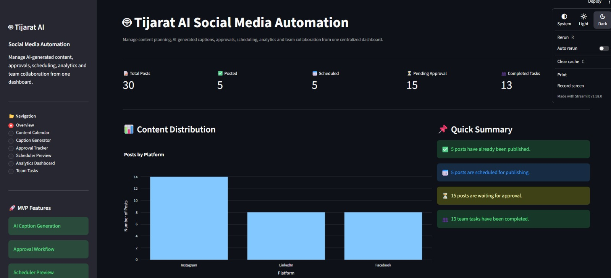
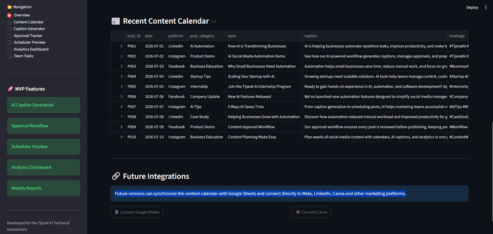
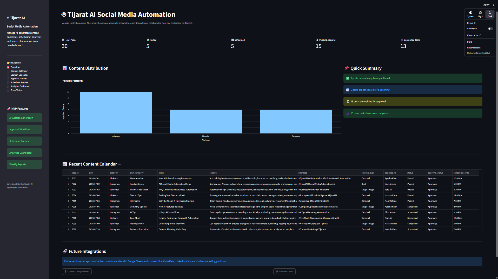
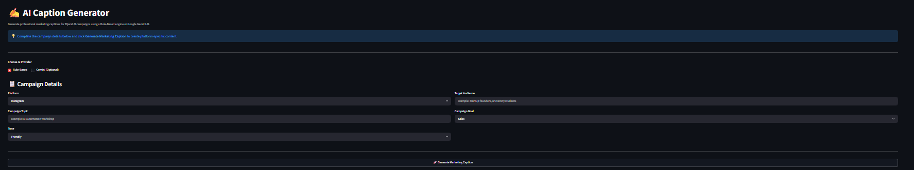
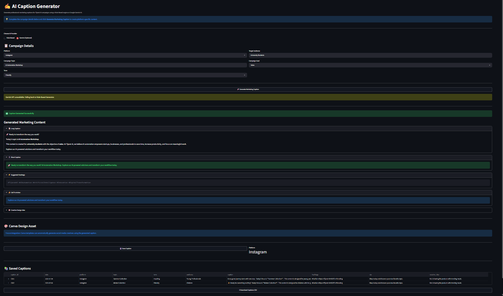
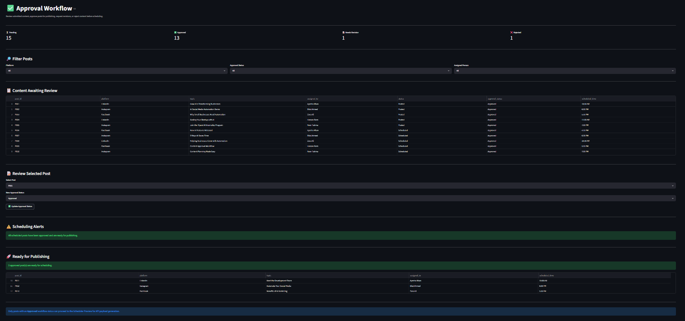
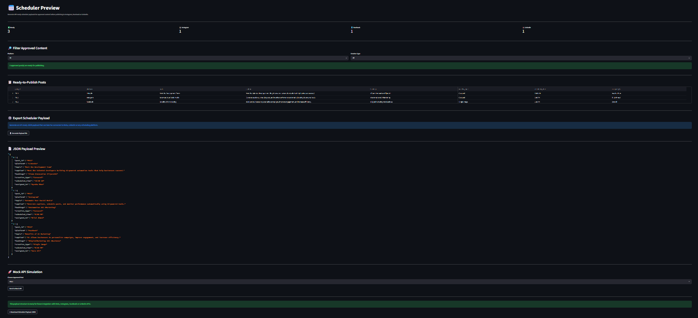
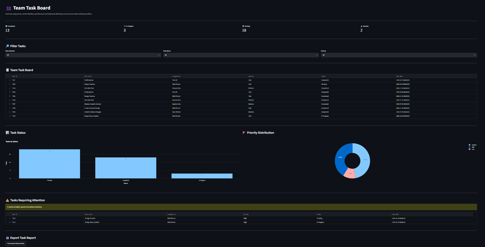

# Tijarat AI Social Media Automation MVP

## Project Overview

This MVP simulates a complete social media marketing workflow, from content planning and AI-assisted caption generation to approval management, scheduling, analytics, and team collaboration.

The **Tijarat AI Social Media Automation MVP** is a Streamlit-based intelligent content management system that simulates a full social media marketing workflow.

It covers:

- Content planning  
- AI caption generation  
- Approval workflows  
- Scheduling simulation  
- Analytics tracking  
- Team task management  

This project is built as an **MVP for internship evaluation**, using CSV-based datasets and mock integrations that can later be replaced with real APIs.

---

## 🧠 AI & Automation Features

- Rule-based caption generation engine
- Optional Google Gemini AI integration
- Automated engagement rate calculation
- Content category performance analysis
- Smart weekly reporting system
- API-ready scheduler payload generation

---

## Key Features

- 📊 Dashboard Overview with business metrics
- 📅 30-Post Content Calendar
- ✍️ AI Caption Generator
  - Rule-Based Caption Generator
  - Optional Google Gemini Integration (Free Tier)
- ✅ Content Approval Workflow System
- 📆 Scheduler Payload Generator (API-ready JSON)
- 🧪 Built-in Test Case Generator
- 📈 Social Media Analytics Engine/Dashboard
- 👥 Team Task Management System
- 📄 Weekly Performance Summary Generator
- 📁 Export Generated Captions
- 📤 Export Scheduler Payloads
- 📤 Export Test Results
- 📥 Export Weekly Summary
- 📤 Exportable Filtered Reports (CSV/JSON/TXT)
- 🔌 Mock API Integration Layer

---

## Technologies Used

- Python 3
- Streamlit
- Pandas
- Plotly Express
- Google Gemini API (Optional)
- CSV Files
- JSON
- Meta Graph API (planned)
- LinkedIn API (planned)
- Google Sheets API
- Canva API

---

## Project Structure

```
shiza_social_media_automation_mvp/
│
├── app.py
├── README.md
├── requirements.txt
├── .env.example
├── .gitignore
│
├── data/
│   ├── analytics.csv
│   ├── content_calendar.csv
│   ├── team_tasks.csv
│   └── generated_captions.csv
│
├── outputs/
│   ├── scheduler_payloads.json
│   ├── test_results.csv
│   └── weekly_summary.txt
│
├── utils/
│   ├── analytics_engine.py
│   ├── api_placeholders.py
│   ├── caption_generator.py
│   ├── gemini_generator.py
│   ├── scheduler.py
│   └── weekly_summary.py
│
└── screenshots/
```

---

## Installation Guide

### 1. Clone or Download the Project

Download the ZIP file or clone the repository.
OR
```bash
git clone <repo-url>
cd shiza_social_media_automation_mvp

### 2. Create a Virtual Environment

```bash
python -m venv venv
```

### 3. Activate the Environment

**Windows**

```bash
venv\Scripts\activate
```

### 4. Install Dependencies

```bash
pip install -r requirements.txt
```

### 5. Run the Application

```bash
streamlit run app.py
```

---

## 🔌 Future API Integration Guide (IMPORTANT)

This project is designed so it can easily transition from MVP → production system.

---

### 🤖 1. Gemini AI (Caption Generation)

Used for AI-powered captions.

**Setup Steps:**
- Get API key from Google AI Studio
- Add it in `.env` file:

```env
GEMINI_API_KEY=your_api_key_here
```

---

### 📸 2. Meta APIs (Instagram & Facebook)

Used for publishing and scheduling posts.

**Required:**
- Meta Developer Account  
- App ID + App Secret  
- Access Tokens  

```env
META_APP_ID=
META_APP_SECRET=
INSTAGRAM_ACCESS_TOKEN=
FACEBOOK_PAGE_ACCESS_TOKEN=
```

---

### 💼 3. LinkedIn API

Used for publishing professional business posts.

```env
LINKEDIN_ACCESS_TOKEN=
```

---

### 📊 4. Google Sheets API

Used for syncing content calendars and team tasks.

```env
GOOGLE_SHEETS_CREDENTIALS=path_to_credentials.json
```

---

### 🎨 5. Canva API (Design Automation)

Used for generating marketing creatives automatically.

```env
CANVA_API_KEY=
```

---

## Dashboard Modules

### 📊 Dashboard Overview

Displays:

- Total Posts
- Scheduled Posts
- Posted Posts
- Pending Approvals
- Completed Tasks
- Platform Distribution

---

### 📅 Content Calendar

Features:

- Platform Filter
- Status Filter
- View 30 Planned Posts
- Content Planning Dashboard

---

### ✍️ AI Caption Generator

Generate captions using:

- Rule-Based Generator
- Optional Google Gemini AI

Inputs:

- Platform
- Topic
- Tone
- Audience
- Goal

Outputs:

- Long Caption
- Short Caption
- Hashtags
- Call-to-Action
- Creative Idea

Generated captions can be saved to:

```
generated_captions.csv
```

---

### ✅ Approval Tracker

Supports:

- Pending
- Approved
- Rejected
- Needs Revision

Features:

- Update Approval Status
- Approval Queue
- Ready for Scheduling
- Approval Warnings

---

### 📆 Scheduler Preview

Generates:

- API-Ready JSON Payloads
- Mock API Responses
- Scheduler Export

Supported Platforms:

- Instagram
- Facebook
- LinkedIn

---

### 📈 Analytics Dashboard

Calculates:

- Engagement Rate
- Best Performing Platform
- Best Performing Content Category

Visualizations:

- Engagement by Platform
- Reach Trend
- Category Performance
- Likes, Comments and Shares
- Weekly Summary Generator

---

### 👥 Team Task Board

Includes:

- Task Filters
- Priority Filters
- Assigned Team Members
- Overdue Tasks
- Task Status Charts

---

## Screenshots


## Normal UI Dashoboard Overview (scrolled down to see full page)






## **Note:** The screenshots below captured at **25–50% browser zoom** to display the entire application page in a SINGLE IMAGE. The application is designed to be viewed at the default **100% browser zoom**, where the UI appears larger and provides the intended viewing experience.

### Dashboard Overview



### Caption Generator





### Approval Tracker



### Scheduler Preview



### Analytics Dashboard

.png)

.png)

### Team Task Board



## Output Files

The application automatically generates:

- `generated_captions.csv`
- `scheduler_payloads.json`
- `weekly_summary.txt`
- `test_results.csv`

---

## Test Cases

| Test ID | Test Case | Action Taken | Result | Status |
|---------|-----------|--------------|--------|--------|
| TC001 | Generate Instagram Caption | Filled the Caption Generator form and generated an Instagram promotional caption | Caption displayed successfully | ✅ Pass |
| TC002 | Generate LinkedIn Caption | Filled the Caption Generator form and generated a LinkedIn business caption | Caption displayed successfully | ✅ Pass |
| TC003 | Generate Facebook Caption | Filled the Caption Generator form and generated a Facebook recruitment caption | Caption displayed successfully | ✅ Pass |
| TC004 | Filter Pending Approvals | Filtered the Approval Tracker by **Pending** status | Only pending approval posts displayed | ✅ Pass |
| TC005 | Find Overdue Tasks | Opened the Team Task Board and reviewed overdue tasks | Overdue tasks identified correctly | ✅ Pass |
| TC006 | Calculate Engagement Rate | Opened the Analytics Dashboard | Engagement rate calculated and displayed | ✅ Pass |
| TC007 | Identify Best Platform | Viewed platform performance charts on the Analytics Dashboard | Best-performing platform displayed | ✅ Pass |
| TC008 | Generate Scheduler Payload | Filtered approved **Instagram** posts and generated scheduler payload | `scheduler_payloads.json` generated successfully | ✅ Pass |
| TC009 | Generate Weekly Summary | Generated the weekly summary report | `weekly_summary.txt` created successfully | ✅ Pass |
| TC010 | Export Test Results | Generated and downloaded the test results CSV | `test_results.csv` exported successfully | ✅ Pass |

---

## 🧪 Test Coverage

Includes automated validation for:

- Caption generation  
- Approval workflow  
- Analytics calculations  
- Scheduler payload creation  
- Task tracking  
- Report generation  

---

## Mock Integrations

The MVP includes placeholder integrations for:

- Instagram API
- Facebook API
- LinkedIn API
- Meta API
- Google Sheets
- Canva
- Notification System (mock implementation for Email/Slack integration)

These can easily be replaced with production APIs in future versions.

---

## Known Limitations

- Uses CSV files instead of a database, CSV-based storage (no database yet) 
- APIs are placeholders only 
- No real authentication system
- Social media APIs are placeholders
- No auto-posting scheduler
- Gemini integration requires an API key
- MVP-level architecture (not production hardened) 

---

## Future Improvements

- Database Integration (MySQL/PostgreSQL)
- OAuth User Authentication
- Real Instagram, Facebook and LinkedIn APIs
- Real-time social media publishing  
- Google Sheets Synchronization
- Automated Scheduling with Cron Jobs
- AI image generation (Canva/DALL·E) 
- Team Collaboration Features
- Role-Based Access Control
- Cloud Deployment (Streamlit Community Cloud or Azure)

---

## 📝 Summary of Changes (This Version)

This updated version includes:

- ✔ Standardized branding across entire system (**Tijarat AI Social Media Automation**)  
- ✔ Improved AI caption system (Rule-based + Gemini integration)  
- ✔ More relevant content generation (AI automation, startups, internships, business education)  
- ✔ Improved scheduler payload structure (API-ready JSON format)  
- ✔ Enhanced UI structure and workflow clarity  
- ✔ Added complete future API integration guide for:
  - Gemini AI  
  - Meta (Instagram/Facebook)  
  - LinkedIn API  
  - Google Sheets API  
  - Canva API  
- ✔ Cleaner production-ready documentation format  
- ✔ Clear separation of MVP vs future production features  
```

---

## Author

**Shiza Tariq**

Tijarat AI Internship Technical Assessment

2026
